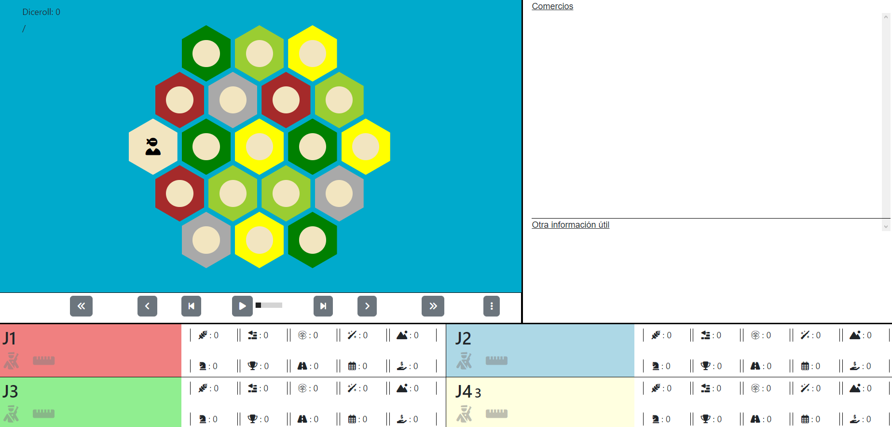

# Catan Agents Project

This repository contains my work on intelligent agents for Catan, developed from the base codebase provided by the professor for the course assignment. The original base included the simulator, the general agent structure, and the components needed to run matches and benchmarks. From that starting point, the work done here consists of adapting and extending that teaching codebase to cover the heuristics and language model practice.

## Reference to the original codebase

This project is based on the simulator and initial structure provided by the professor as the base material for the assignment. On top of that foundation, the core game components have been preserved and new pieces have been added for the experimental part of the project.

Original reference repository:

- [PyCatan](https://github.com/jaumejordan/PyCatan.git)

If you need a short formulation for the final report, a correct way to cite it would be:

> Work developed from the base Catan simulator codebase provided by the professor for the assignment, using the PyCatan repository as reference: https://github.com/jaumejordan/PyCatan.git

## Changes made on top of the original base

The main changes introduced in this adaptation are:

- Development of a custom heuristic agent in [HeuristicAgent.py](/root/catan-ai-agents/Agents/HeuristicAgent.py).
- Extraction of strategic evaluation logic into [HeuristicEvaluator.py](/root/catan-ai-agents/Strategy/HeuristicEvaluator.py).
- Integration of a hybrid LLM-enabled agent in [HybridLLMAgent.py](/root/catan-ai-agents/Agents/HybridLLMAgent.py).
- Unified LLM provider layer in `LLM/`, with support for `Poligpt`, `Ollama`, `Bedrock`, and `mock` mode.
- Versioned prompt system in `LLM/prompts/`.
- Benchmark adaptations to evaluate the agent against `RandomAgent` and the standard agents available in the repository.
- Analysis scripts to summarize results and generate charts from experiments.
- Robustness and compatibility adjustments in parts of the engine to make testing and reproducibility easier.

## Relevant project structure

- [Agents/HeuristicAgent.py](/root/catan-ai-agents/Agents/HeuristicAgent.py): main heuristic agent.
- [Agents/HybridLLMAgent.py](/root/catan-ai-agents/Agents/HybridLLMAgent.py): hybrid agent with heuristic fallback.
- [Strategy/HeuristicEvaluator.py](/root/catan-ai-agents/Strategy/HeuristicEvaluator.py): evaluation functions for nodes, roads, trading, and robber actions.
- [LLM/providers.py](/root/catan-ai-agents/LLM/providers.py): model provider integration.
- [Benchmarks/benchmark_vs_random.py](/root/catan-ai-agents/Benchmarks/benchmark_vs_random.py): benchmark against random.
- [Benchmarks/benchmark_vs_agentes_estandar.py](/root/catan-ai-agents/Benchmarks/benchmark_vs_agentes_estandar.py): benchmark against the available standard agents.
- [Experiments/analyze_results.py](/root/catan-ai-agents/Experiments/analyze_results.py): result analysis and chart generation.

## Agents implemented for the project

### Heuristic agent

The heuristic agent implements explicit rules for:

- initial placement
- build prioritization
- trade decisions with the bank or ports
- robber movement
- use of some development cards

The main idea is to evaluate expected production, resource diversity, port access, and future road network expansion.

### Hybrid LLM agent

The hybrid agent reuses the heuristic base, but queries a model for some specific decisions:

- `on_game_start`
- `on_build_phase`

If the model response is invalid, times out, or the provider is unavailable, the agent automatically falls back to the heuristic policy.

## Installation

```bash
python -m pip install -r requirements.txt
```

## Model configuration

Main variables:

- `CATAN_LLM_ENABLED=1`
- `CATAN_LLM_PROVIDER=mock|poligpt|ollama|bedrock`
- `CATAN_LLM_MODEL=<model>`
- `CATAN_LLM_PROMPT=direct_short|strict_json|guided_compact`
- `CATAN_LLM_LOG_PATH=artifacts/llm_decisions.jsonl`
- `CATAN_LLM_TIMEOUT_SECONDS=20`

Specific configuration:

- `POLIGPT_KEY` for Poligpt
- `OLLAMA_BASE_URL` for Ollama
- standard AWS credentials and `AWS_DEFAULT_REGION` for Bedrock

## Interactive execution

```bash
python main.py
```

Example agents:

- `HeuristicAgent.HeuristicAgent`
- `HybridLLMAgent.HybridLLMAgent`
- `RandomAgent.RandomAgent`

## Recommended tests for the assignment

### 0. Simple execution scripts

Heuristic:

```bash
./scripts/run_heuristic.sh 20
```

LLM with Poligpt:

```bash
./scripts/run_llm.sh poligpt 10 strict_json
```

LLM with Ollama:

```bash
LLM_PROVIDER=ollama ./scripts/run_llm.sh llama3.2:3b 10 strict_json
```

All results are stored in `results/`.
If you want to include a benchmark against standard agents, add a fourth parameter to the LLM script and a second parameter to the heuristic one.

If you want to run only against standard agents with a short test:

```bash
./scripts/run_llm_standard.sh poligpt 1 strict_json
```

### 1. Heuristic agent vs random

```bash
BENCHMARK_TARGET=heuristic BENCHMARK_RANDOM_MATCHES=20 python Benchmarks/benchmark_vs_random.py
```

### 2. Poligpt

```bash
CATAN_LLM_PROVIDER=poligpt CATAN_LLM_MODEL=openai/poligpt CATAN_LLM_LOG_PATH=artifacts/poligpt_log.jsonl BENCHMARK_TARGET=poligpt BENCHMARK_RANDOM_MATCHES=10 python Benchmarks/benchmark_vs_random.py
```

Prompt sweep with Poligpt:

```bash
MATRIX_PROVIDER=poligpt MATRIX_MODELS=poligpt MATRIX_PROMPTS=direct_short,strict_json,guided_compact python Benchmarks/benchmark_llm_matrix.py
```

Sweep of useful text models in Poligpt:

```bash
MATRIX_PROVIDER=poligpt MATRIX_MODELS=poligpt,poligpt2,qwen,phi4,gemma,llama-mini MATRIX_PROMPTS=strict_json python Benchmarks/benchmark_llm_matrix.py
```

### 3. Ollama

```bash
CATAN_LLM_PROVIDER=ollama CATAN_LLM_MODEL=ollama/llama3.2:3b CATAN_LLM_LOG_PATH=artifacts/ollama_log.jsonl BENCHMARK_TARGET=ollama BENCHMARK_RANDOM_MATCHES=10 python Benchmarks/benchmark_vs_random.py
```

Recommended local model sweep:

```bash
MATRIX_PROVIDER=ollama MATRIX_MODELS=llama3.2:3b,qwen3:4b,gemma3:4b,phi4-mini:3.8b MATRIX_PROMPTS=strict_json python Benchmarks/benchmark_llm_matrix.py
```

### 4. Standard benchmark

```bash
BENCHMARK_TARGET=heuristic BENCHMARK_STANDARD_MATCHES=5 python Benchmarks/benchmark_vs_agentes_estandar.py
```

### 5. Quick checks

```bash
BENCHMARK_QUICK=1 BENCHMARK_TARGET=mock python Benchmarks/benchmark_vs_random.py
```

```bash
BENCHMARK_QUICK=1 BENCHMARK_TARGET=poligpt python Benchmarks/benchmark_vs_random.py
```

## Result analysis

To regenerate tables and report macros from the CSV files in `results/`:

```bash
python memoria/generate_report_data.py
```

And to compile the report:

```bash
cd memoria
pdflatex main.tex
pdflatex main.tex
```

To generate statistics and charts:

```bash
python -m Experiments.analyze_results artifacts/heuristic.json --output-dir artifacts/analysis_heuristic
```

Or by comparing several result files:

```bash
python -m Experiments.analyze_results artifacts/heuristic.json artifacts/llm_poligpt.json --labels heuristic poligpt --output-dir artifacts/analysis_compare
```

The analysis generates:

- JSON summary
- win rate
- average points
- average rounds
- margin over the runner-up
- point and duration distributions

## Visualization

1. Open [index.html](/root/catan-ai-agents/Visualizer/index.html).
2. Load a JSON trace from the file picker.



## Final note

This repository is not intended to replace the professor's original base codebase, but to document and organize the adaptation carried out for the assignment. The main contribution here lies in the design of the heuristic agent, the experimental integration with LLMs, the benchmark adaptations, and the support for reproducible result analysis.
